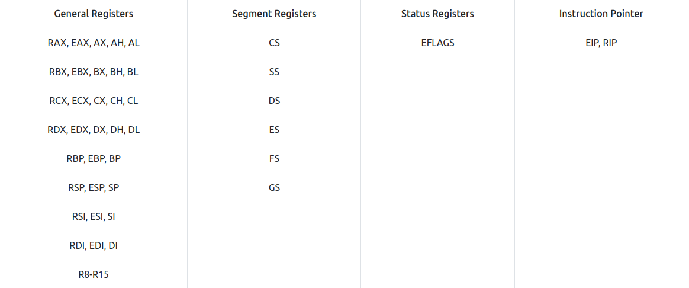

# x86 Architecture 

## CPU Archi
- (I/O Devices) <=> (CPU: Registers <=> Arithmetic Logic Unit <=> Control Unit) <=> (Main Memory RAM)
- Control Unit => takes instructions from RAM, EIP (Instruction Pointer Register)
- Arithmetic Logic Unit => Executes instructions and stores results in Registers or RAM
- Registers => CPU Storage
- RAM => contains code and data for a program to run, CPU access it one instruction at time
- I/O

- En bref: When a program has to be executed, it is loaded into the memory, from there, the Control Unit fetches one instruction at a time, using the Instruction Pointer Register, and the Arithmetic Logic Unit executes it,the results are either stored in the Registers or the RAM.

## Registers
- **Instruction Pointer**: pointer to the next instruction to be executed by the CPU.(EIP for 32bit, RIP for 64bit)

- **General-Purpose Registers**: (32bits/64bits)

- used during the general execution of instruction by the CPU.
- for 64bits (extended registers):
    - **EAX or RAX(Accumulator Register)** : 
        - stores results of Arithmetic Operations.
        - last 16 bits of this register can be accessed by addressing **AX**. Similarly, it can also be addressed in 8 bits by using **AL** for the lower 8 bits and **AH** for the higher 8 bits

        ```assembly
        ; Example of adding two values and storing the result in EAX
        mov eax, 5       ; Move the value 5 into EAX
        add eax, 7       ; Add 7 to the value in EAX
        ; Result (12) is now in EAX
        ```

    - **EBX or RBX(Base Register)** :
        - In the context of memory addressing, it can serve as a base address for data structures or arrays.
        - The base register is often used in combination with an offset to calculate memory addresses. This is known as effective address computation.
        - For example, if you have an array in memory, the base register might hold the starting address of the array, and an offset can be added to it to access a specific element.

        ```assembly
        ; Example of using EBX as a base register for memory addressing
        mov ebx, offset myArray   ; Set EBX to the base address of myArray
        mov eax, [ebx + 4]        ; Load the value at the address (EBX + 4) into EAX
        ```

    - **ECX or RCX(Counter Register)**:
        - The counter register is commonly used as a general-purpose register for various operations.
        - Historically, it has been frequently used as a loop counter in assembly language and low-level programming, though its use is not limited to this purpose.

        ```assembly
        ; Example of using ECX as a loop counter
        mov ecx, 5         ; Set ECX to the loop count (e.g., 5 iterations)
        loop_start:
            ; Code inside the loop
            ; ...

            ; Decrement ECX and check if it's zero
            loop loop_start
        ```

    - **EDX or RDX(Data Register)**: 
        - The data register (EDX/ RDX) is a general-purpose register that can be used for various operations, including data manipulation, arithmetic operations, logical operations, and more.
        - Unlike registers with specific historical uses (e.g., EAX as an accumulator, ECX as a loop counter), EDX/RDX does not have a specialized role and can be employed for a wide range of tasks.
        - The data register is often involved in division operations. For example, in a 32-bit division operation, EDX:EAX is used to represent a 64-bit dividend, and EDX receives the remainder.

        ```assembly
        ; Example of using EDX for data manipulation
        mov edx, 10      ; Set EDX to the value 10
        add edx, 5       ; Add 5 to the value in EDX
        ```

    - **ESP or RSP(Stack Pointer)**:
        - The stack pointer is specifically dedicated to managing the stack. It points to the top of the stack, indicating the current location where data can be pushed onto or popped from the stack and is used in conjunction with the Stack Segment register.
        - ***Push Operation***: When data needs to be added to the stack, the stack pointer is decremented, and the data is stored at the new location pointed to by the stack pointer.
        - ***Pop Operation***: When data is removed from the stack, the data at the current stack pointer location is retrieved, and the stack pointer is incremented.
        - The stack is commonly used to manage function calls. When a function is called, the return address and local variables are often pushed onto the stack. Upon returning from the function, the stack pointer is adjusted to remove this data.
        - The stack is also used in context switching between different threads or processes. The stack pointer is saved as part of the thread or process context, allowing a different execution context to be restored later.

        ```assembly
        ; Example of using ESP for stack operations
        push eax         ; Push the value in EAX onto the stack
        pop ebx          ; Pop the value from the stack into EBX
        ```

    - **EBP or RBP(Base Pointer)** :
        - The base pointer register, often referred to as EBP (32-bit) or RBP (64-bit), is another general-purpose register in x86 and x86-64 architectures. It is commonly used as a frame pointer in the context of function calls and stack-based memory access. The base pointer helps facilitate access to local variables and parameters within a function's stack frame.
        - The base pointer is typically used as a frame pointer in the context of function calls. It helps establish a stable reference point within the stack frame, making it easier to access local variables and parameters.
        - In function prolog (at the beginning of a function), the base pointer is typically pushed onto the stack to save its previous value.
        - The base pointer is then often set to the current stack pointer (ESP/RSP) value, establishing a reference point for the function's stack frame.
        - Local variables and parameters are accessed relative to the base pointer.
        - In the function epilog (at the end of a function), the base pointer is restored to its original value, typically by popping it from the stack.
        - The base pointer simplifies access to local variables and parameters within a function by providing a fixed reference point.
        - Instead of using the stack pointer directly, the base pointer allows for more straightforward addressing of variables, making the code more readable and maintainable.

        ```assembly
        ; Example of using EBP as a base pointer
        push ebp         ; Save the previous value of EBP on the stack
        mov ebp, esp     ; Set EBP to the current value of ESP, establishing the stack frame
        ; Access local variables and parameters using [ebp + offset]
        ; ...
        pop ebp          ; Restore the previous value of EBP from the stack
        ```

    - **ESI or RSI(Source Index)** :
        - source index register, often referred to as ESI (32-bit) or RSI (64-bit), is a general-purpose register in x86 and x86-64 architectures. It is commonly used as a source index during string operations, memory copy operations, and certain data manipulation tasks.
        - The source index register is typically used in conjunction with the destination index register (EDI/RDI) in string operations and memory copy operations.
        - It serves as a source index when copying data from one memory location to another.
        - During string operations (like rep movs or rep cmps), the source index register is often used to point to the source string or memory location.
        - It is commonly involved in memory copy operations, where blocks of data need to be copied from one location to another.
        - While its primary use is in string and memory operations, the source index register can be repurposed for general data manipulation tasks.
        - It can be used as a general-purpose register when not involved in string or memory operations.

        ```assembly
        ; Example of using ESI in a memory copy operation
        mov esi, source_address   ; Set ESI to the source memory address
        mov edi, dest_address     ; Set EDI to the destination memory address
        mov ecx, num_bytes        ; Set ECX to the number of bytes to copy
        rep movsb                 ; Repeat the move byte operation (copying bytes from [ESI] to [EDI])
        ```
    
    -  **EDI or RDI(Destination Index)** :
        - The destination index register, often referred to as EDI (32-bit) or RDI (64-bit), is a general-purpose register in x86 and x86-64 architectures. It is commonly used as a destination index during string operations, memory copy operations, and certain data manipulation tasks.
        - The destination index register is typically used in conjunction with the source index register (ESI/RSI) in string operations and memory copy operations.
        - It serves as a destination index when copying data from one memory location to another.
        - During string operations (like rep movs or rep cmps), the destination index register is often used to point to the destination string or memory location.
        - It is commonly involved in memory copy operations, where blocks of data need to be copied from one location to another.
        - While its primary use is in string and memory operations, the destination index register can be repurposed for general data manipulation tasks.
        - It can be used as a general-purpose register when not involved in string or memory operations.

        ```assembly
        ; Example of using EDI in a memory copy operation
        mov esi, source_address   ; Set ESI to the source memory address
        mov edi, dest_address     ; Set EDI to the destination memory address
        mov ecx, num_bytes        ; Set ECX to the number of bytes to copy
        rep movsb                 ; Repeat the move byte operation (copying bytes from [ESI] to [EDI])
        ```
    
    - **R8-R15(Extended Registers)** :
        - These 64-bit general-purpose registers are not present in 32-bit systems. They were introduced in the 64-bit systems. They are also addressable in 32-bit, 16-bit, and 8-bit modes. For example, for the R8 register, we can use R8D for lower 32-bit addressing, R8W for lower 16-bit addressing, and R8B for lower 8-bit addressing. Here, the suffix D stands for Double-word, W stands for Word, and B stands for Byte.

        ```assembly
        ; Example of using R8-R15 for general-purpose operations
        mov r8, 100       ; Set R8 to the value 100
        add r9, r8, 50    ; Add 50 to the value in R8 and store the result in R9
        ```


- **Status Flag Registers**: (32bits/64bits)

When performing execution, some indication about the status of the execution is sometimes required. This is where the Status Flags come in. This is a single 32-bit register for 32-bit systems called `EFLAGS`, which is extended to 64-bits for 64-bit systems, and called `RFLAGS` in the 64-bit system. The status flags register consists of individual single-bit flags that can be either 1 or 0. Some of the necessary flags are discussed below:


    - **Zero Flag(ZF):** : 
        - The Zero Flag (ZF) specifically indicates whether the result of an operation is zero or not. 


        1. ***Set and Clear***:
        - The Zero Flag is set (ZF=1) when the result of an operation is zero.
        - The Zero Flag is cleared (ZF=0) when the result of an operation is non-zero.
        (For example, if an instruction is executed that subtracts a RAX from itself, the result will be 0. In this situation, the ZF will be set to 1.)


        2. ***Operations***:
        - `Arithmetic Operations`: After arithmetic operations like addition, subtraction, multiplication, and division, the Zero Flag reflects whether the result is zero.
        - `Logical Operations`: After logical operations like AND, OR, XOR, and bit shifts, the Zero Flag reflects whether the result is zero.


        3. ***Conditional Jump and Branch Instructions***:
        - The Zero Flag is often used in conditional jump and branch instructions to determine whether to jump to a particular location in the code based on whether the result of a previous operation was zero or not.


        ```assembly
        ; Example of using the Zero Flag
        mov eax, 0        ; Set EAX to 0
        test eax, eax      ; Perform a bitwise AND operation, affecting the Zero Flag
        ; After the test, ZF is set because the result is zero
        ```
        <br>
        - Conditional Jump exemple:
        
        ```assembly
        ; Example of using the Zero Flag in a conditional jump
        cmp ebx, ecx      ; Compare EBX and ECX
        je  equal_label    ; Jump to 'equal_label' if the Zero Flag is set (i.e., if EBX equals ECX)
        ```
